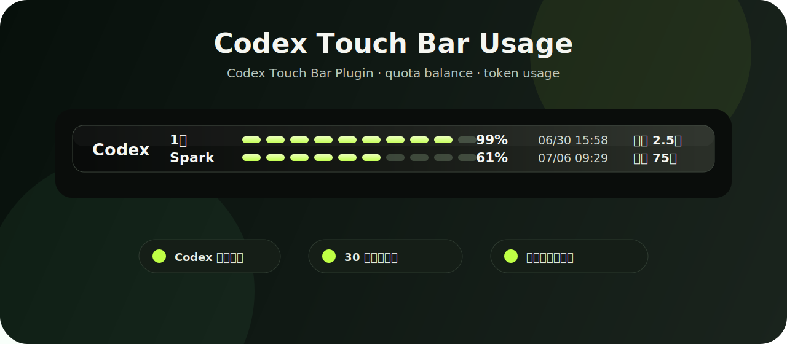

<div align="center">
  
  <h1>Codex Touch Bar Usage</h1>
  <p>
    把 Codex 额度余额、重置时间、昨日/累计 token 用量放到 MacBook Pro Touch Bar 上。
  </p>
</div>

<div align="center">

[](LICENSE)
[](#系统要求)
[](helper/CodexTouchBarHelper)
[](#功能)

</div>



## 概述

**Codex Touch Bar Usage** 是一个轻量的原生 macOS 后台 helper。它会在 Codex 成为前台 App 时，临时接管 Touch Bar 展示一条紧凑的用量面板；切走到其他 App 后自动隐藏，系统亮度、音量等控制条会恢复。

它不是 MTMR 配置，也不依赖 Electron/WebView。核心 UI 是一个 AppKit 自绘 `NSTouchBar` custom view，布局稳定、刷新轻、响应快。

## 功能

| 模块 | 显示内容 |
| --- | --- |
| 标识 | `Codex` 白色斜体标题 |
| 5 小时额度 | 余额胶囊条、余额百分比、重置时间 |
| 1 周额度 | 余额胶囊条、余额百分比、重置时间 |
| token 用量 | 昨日 token、累计 token，按 `万` / `亿` 格式显示 |
| 前台感知 | 只在 Codex 聚焦时显示，切走后隐藏 |
| 轻量刷新 | 本地 token 约 3 秒刷新；远程额度约 30 秒刷新；隐藏时停止刷新 |

## 系统要求

- 带 Touch Bar 的 MacBook Pro
- macOS 12 或更新版本
- 已安装 Codex 桌面应用
- 已登录 Codex，且本机存在 `~/.codex/auth.json`
- Swift toolchain：完整 Xcode 或 Command Line Tools 均可

> 说明：当前项目使用 macOS 私有的 system-modal Touch Bar 能力，目标是本机自用与开源学习，不以 App Store 分发兼容为目标。

## 安装

```bash
git clone https://github.com/Daytimeflow/codex-touchbar-usage.git
cd codex-touchbar-usage
./scripts/install_touchbar_helper.sh
```

安装脚本会：

- 构建原生 Swift helper；
- 安装到 `~/Applications/CodexTouchBarHelper.app`；
- 注册 LaunchAgent：`~/Library/LaunchAgents/com.local.codex-touchbar-helper.plist`；
- 设置登录后自启动；
- 启动后台 helper。

打开 Codex 并让它成为前台窗口，Touch Bar 就会显示用量面板。

## 手动启动

如果重启后没有看到 Touch Bar 面板，先手动启动一次：

```bash
./scripts/start_touchbar_helper.sh
```

检查状态：

```bash
launchctl print-disabled gui/$(id -u) | grep com.local.codex-touchbar-helper
launchctl print gui/$(id -u)/com.local.codex-touchbar-helper
```

预期能看到：

```text
com.local.codex-touchbar-helper => enabled
state = running
```

## 更新

```bash
git pull
./scripts/install_touchbar_helper.sh
```

## 卸载

```bash
./scripts/uninstall_touchbar_helper.sh
```

它会移除：

- `~/Applications/CodexTouchBarHelper.app`
- `~/Library/LaunchAgents/com.local.codex-touchbar-helper.plist`
- 正在运行的 `CodexTouchBarHelper` 进程

不会删除你的 Codex 登录信息，也不会删除 `~/.codex`。

## MTMR 迁移

本项目不依赖 MTMR。公开版安装脚本默认不会删除 MTMR。

如果你确认要迁移并清理 MTMR，可显式运行：

```bash
REMOVE_MTMR=1 ./scripts/install_touchbar_helper.sh
```

脚本会先备份 MTMR 配置到 `~/.codex/touchbar-usage/mtmr-backup-*`，再尝试退出并移除 MTMR。

## 数据来源

| 数据 | 来源 |
| --- | --- |
| 额度余额 / 重置时间 | Codex usage endpoint，经 `~/.codex/auth.json` 中的 access token 鉴权 |
| 最近 token 信息 | 本地 Codex session JSONL |
| 昨日 / 累计 token | 本地 `last_token_usage.total_tokens` 增量统计 |
| 缓存 | `~/.codex/touchbar-usage/` |

隐私原则：

- 不上传本地 session 内容；
- 不记录或打印 access token；
- helper 隐藏时不刷新 UI、不请求网络；
- 远程请求仅用于额度余额和重置时间。

## 常用命令

打印一次当前快照：

```bash
~/Applications/CodexTouchBarHelper.app/Contents/MacOS/CodexTouchBarHelper --once-json
```

只使用本地缓存/session：

```bash
~/Applications/CodexTouchBarHelper.app/Contents/MacOS/CodexTouchBarHelper --once-json --no-remote
```

重建本地 token 统计缓存：

```bash
~/Applications/CodexTouchBarHelper.app/Contents/MacOS/CodexTouchBarHelper --rebuild-token-stats
```

查看日志：

```bash
tail -f ~/.codex/touchbar-usage/helper.err.log
tail -f ~/.codex/touchbar-usage/helper.out.log
```

## 常见问题

### Touch Bar 没有亮

先确认系统 Touch Bar 本身是否工作。如果亮度、音量按钮也不显示，通常是 macOS Touch Bar 服务卡住了，可以尝试：

```bash
killall ControlStrip
```

如果仍然全黑，可能需要重启系统级 TouchBarServer：

```bash
sudo pkill TouchBarServer
```

### helper 启动了，但没有显示 Codex 面板

确认 Codex 是前台 App：

```bash
launchctl print gui/$(id -u)/com.local.codex-touchbar-helper
```

LaunchAgent 默认匹配：

```text
Codex,com.openai.codex
```

如果你使用的是改名版 Codex，可修改 LaunchAgent 中的 `CODEX_TOUCHBAR_TARGET_APPS`。

### token 用量为什么不是实时逐字跳动？

Codex 通常在一次回复或任务完成后把 token usage 写入本地 JSONL。helper 会约每 3 秒读取增量，所以写入后会很快更新，但不会在模型输出每个字时变化。

### 为什么不用 MTMR？

MTMR 很适合配置静态 Touch Bar item，但这里需要更细的绘制、对齐、动画和前台感知控制。原生 AppKit helper 可以把整条内容作为一个轻量 custom view 绘制，避免多 item 布局错位。

## 开发

构建：

```bash
./scripts/build_touchbar_helper.sh
```

测试：

```bash
cd helper/CodexTouchBarHelper
swift test
```

如果当前机器只有 Command Line Tools 且 SwiftPM 不可用，构建脚本会自动 fallback 到直接 `swiftc` 编译。

## 路线图

- [ ] 发布预构建 `.app` release 包
- [ ] 增加菜单栏状态入口
- [ ] 增加可配置刷新间隔
- [ ] 增加更多 Codex surface 的 token 统计维度

## 免责声明

本项目是非官方工具，与 OpenAI / Codex 官方没有隶属关系。Codex 内部接口、session JSONL 结构、Touch Bar system-modal API 都可能随系统或应用版本变化而变化。请自行评估风险后使用。

## 支持与赞助

如果这个小工具节省了你的心智负担，欢迎点一个 Star，也欢迎扫码请作者喝杯咖啡。

| 支付宝 | 微信 |
| --- | --- |
|  |  |

## Star History

[](https://star-history.com/#Daytimeflow/codex-touchbar-usage&Date)
