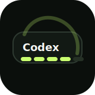

<div align="center">
  
  <h1>Codex Touch Bar Usage</h1>
  <p>
    专为 Codex 打造的 MacBook Pro Touch Bar 用量插件。
  </p>
  <p>
    一眼看到 Codex 额度余额、重置时间、昨日 token、累计 token。
  </p>
</div>

<p align="center">
  <strong>简体中文</strong> · <a href="README.en.md">English</a>
</p>

<div align="center">

[](LICENSE)
[](https://github.com/Daytimeflow/codex-touchbar-usage/releases/latest)
[](#系统要求)
[](helper/CodexTouchBarHelper)
[](#功能)
[](#安装)

</div>


<p align="center"><sub>聚焦 Codex 时显示额度与 token 用量；切换到其他 App 后自动恢复系统控制条。</sub></p>

## 概述

**Codex Touch Bar Usage** 是一个专为 Codex 高频用户打造的原生 Touch Bar 插件，把最常查看的 Codex 用量信息直接放到键盘上方。

当 Codex 成为前台 App 时，它会临时接管 Touch Bar 展示一条紧凑的用量面板；切走到其他 App 后自动隐藏，系统亮度、音量等控制条会恢复。

它不是 Electron/WebView，也不是简单拼接多个 Touch Bar item。核心 UI 是一个 AppKit 自绘 `NSTouchBar` custom view，布局稳定、刷新轻、响应快。

## 功能

| 模块 | 显示内容 |
| --- | --- |
| 标识 | `Codex` 白色斜体标题 |
| 5 小时额度 | 余额胶囊条、余额百分比、重置时间 |
| 1 周额度 | 余额胶囊条、余额百分比、重置时间 |
| token 用量 | 昨日 token、累计 token，按 `万` / `亿` 格式显示 |
| 前台感知 | 只在 Codex 聚焦时显示，切走后隐藏 |
| 轻量刷新 | 官方额度与 token 数据约 30 秒刷新；隐藏时停止刷新；本地统计仅在官方数据不可用时降级启用 |

## 为什么是它

| 设计重点 | Codex Touch Bar Usage |
| --- | --- |
| Codex 专属 | 围绕 5 小时 / 1 周额度、重置时间、昨日 / 累计 token 设计，不做无关仪表盘 |
| 官方账户口径 | 优先读取 Codex 官方 app-server 数据，token 数值与个人资料页保持同一口径 |
| 前台即用 | 只在 Codex / ChatGPT 位于前台时显示，切走后恢复亮度、音量等系统控制 |
| 原生轻量 | Swift + AppKit 单一自绘视图，无 Electron / WebView；前台切换由系统事件驱动，隐藏时零刷新 |
| 信息完整 | 余额胶囊条支持部分填充，同时展示余额百分比、统一重置时间和账户 token 用量 |

## 适合谁

- 每天长时间使用 Codex / Codex CLI / Codex Desktop 的用户；
- 想随时知道 5 小时额度和 1 周额度还剩多少的人；
- 想看昨日和累计 token 消耗，但不想频繁打开个人资料页的人；
- 还在用带 Touch Bar 的 MacBook Pro，想让这条屏幕重新有点存在感的人。

关键词：`Codex Touch Bar`、`Codex 用量`、`Codex token 统计`、`Codex quota`、`MacBook Pro Touch Bar plugin`。

## 系统要求

- 带 Touch Bar 的 MacBook Pro
- macOS 12 或更新版本
- 已安装最新版 Codex / ChatGPT 桌面应用（新版外壳仍使用 Codex 服务）
- 已登录 Codex，且本机存在 `~/.codex/auth.json`
- Swift toolchain：完整 Xcode 或 Command Line Tools 均可

> 说明：当前项目使用 macOS 私有的 system-modal Touch Bar 能力，目标是本机自用与开源学习，不以 App Store 分发兼容为目标。

## 安装

### Homebrew（推荐）

```bash
brew install --cask daytimeflow/tap/codex-touchbar-usage
```

Cask 会自动安装 helper、注册 LaunchAgent 并立即启动，无需再执行 `brew services start`。

升级：

```bash
brew update
brew upgrade --cask codex-touchbar-usage
```

### GitHub Release（Apple Silicon）

从 [Releases](https://github.com/Daytimeflow/codex-touchbar-usage/releases/latest) 下载 `CodexTouchBarUsage-v0.3.3-arm64.zip` 和对应的 `.sha256`：

```bash
shasum -a 256 -c CodexTouchBarUsage-v0.3.3-arm64.zip.sha256
unzip CodexTouchBarUsage-v0.3.3-arm64.zip
cd CodexTouchBarUsage-v0.3.3-arm64
./install.sh
```

预构建包采用 ad-hoc 签名，暂未经过 Apple notarization。如果 Gatekeeper 阻止启动，优先使用 Homebrew 或源码安装。

### 源码安装

```bash
git clone https://github.com/Daytimeflow/codex-touchbar-usage.git
cd codex-touchbar-usage
./scripts/install_touchbar_helper.sh
```

安装脚本会：

- 构建原生 Swift helper；
- 安装到 `~/Applications/CodexTouchBarHelper.app`；
- 注册 LaunchAgent：`~/Library/LaunchAgents/com.local.codex-touchbar-helper.plist`；
- 设置登录后自启动；
- 启动后台 helper。

打开 Codex 并让它成为前台窗口，Touch Bar 就会显示用量面板。

## 手动启动

如果重启后没有看到 Touch Bar 面板，先手动启动一次：

```bash
./scripts/start_touchbar_helper.sh
```

检查状态：

```bash
launchctl print-disabled gui/$(id -u) | grep com.local.codex-touchbar-helper
launchctl print gui/$(id -u)/com.local.codex-touchbar-helper
```

预期能看到：

```text
com.local.codex-touchbar-helper => enabled
state = running
```

## 更新

Homebrew 安装：

```bash
brew update
brew upgrade --cask codex-touchbar-usage
```

源码安装：

```bash
git pull
./scripts/install_touchbar_helper.sh
```

## 卸载

Homebrew 安装：

```bash
brew uninstall --cask codex-touchbar-usage
```

Release 安装（在解压目录中）：

```bash
./uninstall.sh
```

源码安装（在仓库目录中）：

```bash
./scripts/uninstall_touchbar_helper.sh
```

它会移除：

- `~/Applications/CodexTouchBarHelper.app`
- `~/Library/LaunchAgents/com.local.codex-touchbar-helper.plist`
- 正在运行的 `CodexTouchBarHelper` 进程

不会删除你的 Codex 登录信息，也不会删除 `~/.codex`。

## 数据来源

| 数据 | 来源 |
| --- | --- |
| 额度余额 / 重置时间 | Codex 官方 app-server `account/rateLimits/read` |
| 昨日 / 累计 token | Codex 官方 app-server `account/usage/read`，与个人资料页同口径 |
| 本地降级 | Codex session JSONL 与 usage cache；官方数据不可用时启用 |
| 缓存 | `~/.codex/touchbar-usage/` |

隐私原则：

- 不上传本地 session 内容；
- 不记录或打印 access token；
- helper 隐藏时不刷新 UI、不请求网络；
- app-server 只在刷新官方数据时短暂启动，读取完成立即退出，不增加常驻进程。

## 常用命令

打印一次当前快照：

```bash
~/Applications/CodexTouchBarHelper.app/Contents/MacOS/CodexTouchBarHelper --once-json
```

只使用本地缓存/session：

```bash
~/Applications/CodexTouchBarHelper.app/Contents/MacOS/CodexTouchBarHelper --once-json --no-remote
```

重建本地 token 统计缓存：

```bash
~/Applications/CodexTouchBarHelper.app/Contents/MacOS/CodexTouchBarHelper --rebuild-token-stats
```

查看日志：

```bash
tail -f ~/.codex/touchbar-usage/helper.err.log
tail -f ~/.codex/touchbar-usage/helper.out.log
```

## 常见问题

### 这是 Codex 官方插件吗？

不是。它是社区/个人维护的 Codex Touch Bar 用量插件，目标是服务 Codex 用户的本机工作流。项目不会冒充官方，也不会使用 OpenAI / Codex 的商标做官方背书。

### Touch Bar 没有亮

先确认系统 Touch Bar 本身是否工作。如果亮度、音量按钮也不显示，通常是 macOS Touch Bar 服务卡住了，可以尝试：

```bash
killall ControlStrip
```

如果仍然全黑，可能需要重启系统级 TouchBarServer：

```bash
sudo pkill TouchBarServer
```

### helper 启动了，但没有显示 Codex 面板

确认 Codex 是前台 App：

```bash
launchctl print gui/$(id -u)/com.local.codex-touchbar-helper
```

LaunchAgent 默认匹配：

```text
Codex,ChatGPT,com.openai.codex
```

如果你使用的是改名版 Codex，可修改 LaunchAgent 中的 `CODEX_TOUCHBAR_TARGET_APPS`。

### 会占用多少存储空间？需要定期清理吗？

helper 自身只在 `~/.codex/touchbar-usage/` 保存小型缓存和诊断日志，通常是 MB 级；安装脚本会轮换超过 2 MB 的 helper 日志。`~/.codex/sessions/` 属于 Codex 的任务历史，不是本插件创建的，删除后会影响历史任务和上下文恢复，因此不要为了清理插件而删除它。

可以分别检查两者大小：

```bash
du -sh ~/.codex/touchbar-usage ~/.codex/sessions
```

### token 用量为什么不是实时逐字跳动？

右侧数值采用 Codex 个人资料页的官方账户统计，helper 约每 30 秒刷新一次。官方统计本身可能批量更新，因此不会随模型输出逐字变化；本地 JSONL 增量只在官方统计不可用时作为降级数据。

## 开发

构建：

```bash
./scripts/build_touchbar_helper.sh
```

测试：

```bash
cd helper/CodexTouchBarHelper
swift test
```

如果当前机器只有 Command Line Tools 且 SwiftPM 不可用，构建脚本会自动 fallback 到直接 `swiftc` 编译。

## 路线图

- [x] 发布 Apple Silicon 预构建 `.app` Release
- [x] 支持 Homebrew Tap 一行安装
- [ ] 增加菜单栏状态入口
- [ ] 增加可配置刷新间隔
- [ ] 增加更多 Codex surface 的 token 统计维度

## 免责声明

本项目是非官方 Codex Touch Bar 插件，与 OpenAI / Codex 官方没有隶属、授权或背书关系。Codex 内部接口、session JSONL 结构、Touch Bar system-modal API 都可能随系统或应用版本变化而变化。请自行评估风险后使用。

## 支持与赞助

如果这个小工具节省了你的负担，欢迎点一个 Star，也欢迎扫码请作者喝杯咖啡。

| 支付宝 | 微信 |
| --- | --- |
|  |  |
